# rancher/kuberlr-kubectl
A simple way to invoke the correct [kubectl](https://github.com/rancher/kubectl) version on a Rancher managed cluster using [kuberlr](https://github.com/flavio/kuberlr).

Images found at:

- https://hub.docker.com/r/rancher/kuberlr-kubectl
- https://github.com/rancher/kuberlr-kubectl/pkgs/container/kuberlr-kubectl

## Details
This repo produces a Rancher specific version of the `flavio/kuberlr` image.

  - This container is analogous to the current `rancher/kubectl` container, but based on [kuberlr](https://github.com/flavio/kuberlr)
  - Unlike `rancher/kubectl`, this image targets specific Rancher minor release branches.
  - Each release pre-bundles all necessary [kubectl](https://github.com/rancher/kubectl) versions supported by the Rancher version the release supports.

## Branches, Releases, and Rancher
| Branch              | Release Tag   | Rancher Tag (Branch)   |
|---------------------|---------------|------------------------|
| main (release/v6.x) | head (v6.Y.Z) | 2.13.Z (main)          |
| release/v5.x        | v5.Y.Z        | 2.12.Z (release/v2.12) |
| release/v4.x        | v4.Y.Z        | 2.11.Z (release/v2.11) |
| release/v3.x        | v3.Y.Z        | 2.10.Z (release/v2.10) |
| release/v2.x        | v2.Y.Z        | 2.9.Z (release/v2.9)   |

### Notes:
- Each minor Rancher release will get a `rancher/kuberlr-kubectl` branch:
  - Each branch will get an image tag major to match it.
  - This gives us full "Y" and "Z" control on versioning the component to target Rancher minors.
  - E.x. Rancher 2.10.x releases will get varying versions of 3.Y.Z

### Migration

See the dedicated [Migration's Doc](/docs/chart-migration.md) for specific details on migrating charts.

### Compatability

The base `flavio/kuberlr` image comes from the upstream repo and is essentially universally compatible like `kuberlr`.
However, for it to work it relies on an internet connection to fetch kubectl binaries on the fly.

In contrast, our `rancher/kuberlr-kubectl` bundles the necessary `kubectl` binaries into each image.
In this way the image is ready to work on any supported k8s versions for that Rancher release in an air-gap out the box.
Given that k8s provides a slight version drift, as the Rancher minor lifecycle progresses we reduce inclusion of older `kubectl` versions.

```mermaid

gantt
  title `rancher/rancher` and `rancher/kuberlr-kubectl`
  todayMarker off
  dateFormat X
  axisFormat 1.%S
  tickInterval 1second
  section Rancher
    2.11.X           :30,32
    2.10.X           :28,31
    2.9.X           :27,30
  section kuberlr-kubectl image
    4.Y.Z   :30,32
    3.Y.Z   :28,31
    2.Y.Z   :27,30
  section Kubectl Drift
    1.27              :26,28
    1.28              :27,29
    1.29              :28,30
    1.30              :29,31
    1.31              :30,32
    1.32              :31,33
```

> Note: Over-time, as new `kuberlr` binaries are released we can still bump the Y or Z of each `rancher/kuberlr-kubectl` release to update all supported Rancher releases.